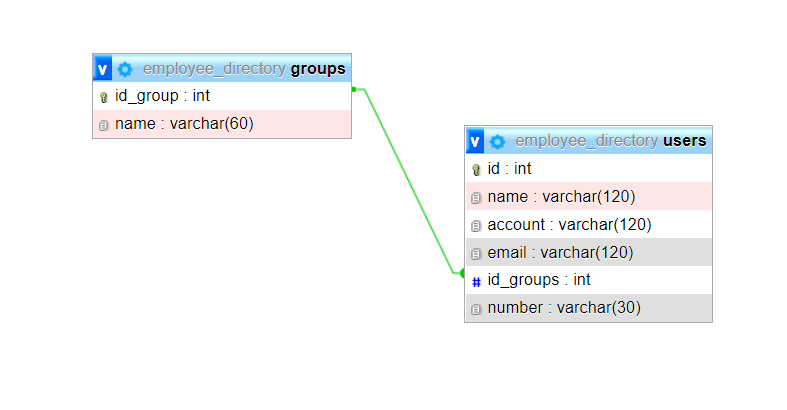

# Employee Directory

---

## Technologies

Frontend
- HTML / CSS
- Bootstrap / Ant Design
- JavaScript/React/Redux
- API/Axios

Backend
- JavaScript / Express
- Sql / MySql

## Installing
```sh
> npm install
> npm install backend/server
> npm start
starting the database
> node backend/server/server.js
```

## Database scheme
 


---


